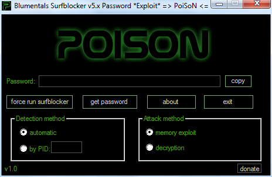

## PoiSoN

A [Blumentals Surfblocker](https://www.surfblocker.com/) v5.x password exploitation tool.   
It is released as a reverse engineering proof-of-concept code.

### Screenshot & demo

 


https://user-images.githubusercontent.com/95986479/146421266-fce08fbc-0f02-43d5-b289-3d9dc4d0fed0.mp4


### How to use

Simply run **poison.exe** and click on _get password_ button.   

There are two "attack" methods - memory exploit and decryption.   

If the memory exploit option is used, make sure that the Surfblocker process is running.

In case of multiple user accounts logged in at the same time, Surfblocker main executable will run in whichever account gets logged in first, as it allows only one instance in memory.   

To overcome this, use ***force run surfblocker*** option to forcibly execute another instance under your account, thus enabling you to use memory exploit option, since  the new instance now runs under your account privileges.

The decryption method doesn't require all of this, as it works by decrypting password stored in the Windows registry.

### How to build

Install either GCC or MSVC compiler and set PATH environment variable correctly to point to your chosen compiler, then run **build.bat** script. The script prefers GCC, but if it is not available it will try to build using MSVC.

This tool is intended to be compiled as a 32-bit binary, so make sure you have set your compiler to output 32-bit image.

### Affected versions

Following Surfblocker versions are affected:
 
**5.8, 5.9, 5.10, 5.11, 5.12**

### Note on antivirus

Your antivirus software may flag this tool as a malware or potentially unwanted program (PUP).   
Please ignore this, and add it to your antivirus exclusion list.

### Support


If you would like to see more projects like this one, please consider supporting me :)  

Donate bitcoin to the following address:


```
bc1qjwedefp3xruv7qak72l89hzx5mx0c0ftq8qem7
```
